:noaudio:
:scrollbar:
:data-uri:
:toc2:
:linkattrs:

:numbered:

== Introduction to Red Hat 3scale API Management

*Goal:*

* This blog will cover a basic introduction to the API Economy and key features of the Red Hat 3scale API Management Plaform. For more info about the Red Hat 3scale product please refer to the corresponding
https://www.redhat.com/en/technologies/jboss-middleware/3scale[product page].

* Create a 3scale by Red Hat account
* Become familiar with the structure and functionality of the product's Admin Portal
* How to Manage an API?

== Overview

The Red Hat 3scale API Management Platform allows to take control of digital assets and APIs with a solution that is unmatched in scale, performance and flexibility. In this course we will cover basic introduction to the API Economy and key features of the Red Hat 3scale API Management Plaform.

The course is structured as follows:

. General introduction to the opportunity offered by the API Economy
. 3scale's market positioning, including customer landscape
. 3scale API Management solution architecture and key features
. 3scale product demo

== Welcome to the API Economy
Without a doubt application programming interfaces (APIs) are becoming more and more essential in every digital transformation or digital strategy initiative. This and the fact that APIs underpin the way modern business is conducted led to the notion of the “API Economy” -- in other words the economy enabled by APIs where suppliers and consumers trade access to digital assets via standard interfaces.

APIs are core for business success and every organization that has a website will have an API in less than five years time. Several growth drivers support this trend: Forrester concluded that today already 54% of all ecommerce sales are completed via mobile apps. Gartner estimates that by the end of this year, half of all B2B collaborations will be conducted via APIs. And IDC claims that the whole IoT market is worth $7.1 trillion in 2020. All of these are enabled via APIs.

There is a very wide spectrum of organisations that already successfully leverage APIs to support corporate strategies and achieve objectives. Two well-known examples are:
Expedia, who generates an annual revenue of $4bn directly from their API program, and eBay, who creates and manages over 60% of all listed items via APIs.

=== APIs need to be managed

How can this immense value offered by the API Economy be captured?

The first step is to make the organization’s valuable, digital assets machine-accessible –- by way of APIs. But that is only the tip of the iceberg. In order to get full visibility and control over who can use the assets and how, API management solutions are required. This is the only way to devise, execute, monitor and improve a strategy leveraging APIs.

API management solutions are the core ingredient required to execute your API strategy. We refer to the execution of the API strategy as an "API program". It takes care of API operations such as access control, usage policies, monitoring, billing and scaling. Another equally important aspect of an API program is to increase visibility and accessibility of the API for API consumers via developer portals and API documentation.

=== Typical API Management Business Objectives

Leveraging APIs via API management is necessary to gain the benefits of modern business, and that is true across all verticals.

3scale researched the main drivers for exposing and managing assets via APIs. The result is a unique model that 3scale uses to qualify customer opportunities,  as well as consult customers.

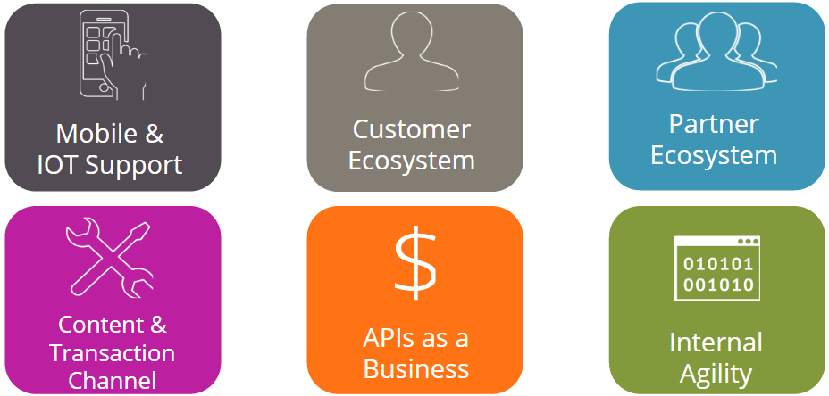

There are six main types of business objectives:

. The first business objective that organizations aim to achieve with APIs and API management is to enable mobile and IoT apps and channels.
. The second and the third type of objective is about building ecosystems around the digital assets exposed via APIs. The main difference between the two is that the second is aiming at customers directly (hence B2C scenarios) and the third is aiming at partners (B2B scenarios).
. The next objective is to monetize access to APIs directly, which we refer to as “APIs as a business.”
. The fifth objective is to increase the potential outreach of an organizations content by opening it up and leveraging network effects as in media distribution.
. The sith and final business objective is about increasing internal agility. Standardizing access to internal data is a very effective way to improve system design and allow organisations to adapt to external and internal changes rapidly. An often-cited example for solely relying on APIs internally is Amazon, and the establishment of Amazon Web Services (AWS).

== 3scale Customer Landscape

The way 3scale supports customers to achieve these objectives is unique and has helped them to succeed in the API Economy.

3scale is the market leader in terms of number of customers. One of the key differentiating factors of 3scale is the extremely quick time-to-value. Customers who decide to go with 3scale have a very short time to go-live period and can leverage the benefits of API management almost immediately.

Secondly, 3scale offers customers a wide range of flexible deployment options. This stems from the fact that our hybrid architecture separates API management policy configuration ("API Manager") and policy execution ("APIcast API Gateway").

Finally, 3scale is future proof. Not only is 3scale the most cost effective solution on the market, we also provide highest availability and scalability performance.

Currently, 3scale powers more APIs across industries than all the other vendors combined. 3scale does not have a specific focus on any vertical, but we see a lot of traction in transportation and media.

=== Customer Success Stories

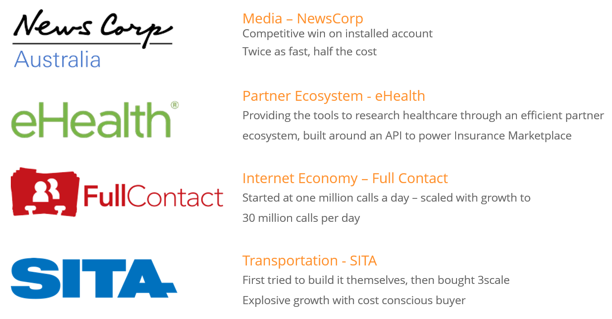

An example of a media content distribution case is NewsCorp, which was a competitive win on an installed account which deliveres twice the performance at half the cost.

Another example is eHealth, a global company that provides a broad portfolio of eHealth services. Their main objective was to establish a solid partner ecosystem all around their API program.

Full Contact built a business around acquiring and managing contact data. They are a high volume customer in terms of API traffic, and, all their integrations with other 3rd parties – suppliers or consumers – integrate with Full Contact using the APIs managed by 3scale.

SITA is another amazing example about the benefits of APIs. If you have ever taken a flight you have almost certainly used SITA APIs. For instance, self-check-in terminals at airports rely on SITA’s APIs.

== The Red Hat 3scale API Management Platform

The key benefits of the 3scale API management solution can be summarized with three attributes: control, flexibility and visibility. These attributes are critical when it comes to API management and running successful API programs:

* You need to control who gets access to which API endpoints, and what they can do with it.
* You want to deploy a solution that is flexible enough to meet your specific requirements, but that also adapts to changes.
* And finally, you need the visibility to generate the necessary intelligence about your APIs, which then allows you to adapt and continuously improve your API program.

=== Solution Architecture and Deployment Overview

The figure below the basic set up of a 3scale powered API.

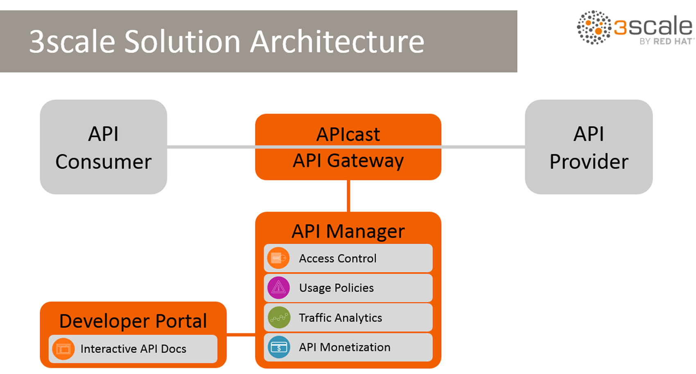

On the left-hand side, the grey box represents API consumers. On the right, represented by another grey box, we have a typical API provider. API calls –- requests and responses –- are exchanged between the two.

In the middle is the 3scale solution, which is split into three elements to follow a recommended separation-of-concerns approach according to Gartner's http://www.gartner.com/document/3168517[Guidance Framework for Evaluating API Management Solutions].

The orange box at the top is 3scale's APIcast API gateway which is responsible for API management policy execution, or traffic management. APIcast can be deployed wherever the customer wishes: on-premise, private- or public cloud.

The larger orange box below is the 3scale API Manager, which represents API management policy configuration, analytics and billing. This is the element that is hosted as a multitenant infrastructure in the cloud (AWS) but is currently Dockerized and will be available on the Red Hat OpenShift PaaS, and later open-sourced.

Finally, the third and last element is the 3scale Developer Portal, which allows API providers to expose and present their APIs to API consumers. This portal provides a content management system (CMS) that is based on standard Web technologies and, thus, easy and quick to learn. The portal also offers interactive API documentation based on the https://www.openapis.org/[Open API Inititive] (OAI) community standard (aka and formerly http://swagger.io/[Swagger]).

=== Key API Management Solution Features

Overall, the Red Hat 3scale API Management Platform provides five key features, which are:

. Access control and security
. API contracts and rate limits
. Analytics and reporting
. Developer portal and interactive API documentation
. API billing and payments

Before we go into more details regarding the five key features, it's important to emphasize a few benefits:

One of the key differentiating factors of the 3scale API management solution is the unique hybrid architecture. This is achieved by a logical separation of concerns into three main elements:

* APIcast: the API management policy execution ("traffic managers" aka API gateways)
* API Manager: the API management policy configuration, analytics and billing
* Developer Portal: API consumer facing element

Especially APIcast and the API Manager communicate with each other in an asynchronous fashion, leveraging caching on APIcast (ie, the API gateway). The advantage of this unique setup is that if  the API Manager is not available, the whole API program is still fully functional.

A consequence of this is increased performance and very little latency because API calls do not have to be routed though the 3scale API Manager infrastructure. The call flow and with that the customers data never leaves the customer's premise.

A second benefit is that with 3scale, the API provider gets a rich API admin portal including performance dashboards, and developer facing portals for exposing and documenting APIs.

Additionally, customers with Enterprise license get access to all the 3scale features via APIs as well.

=== Feature 1: Access Control

API access control, is where we offer a variety of access mechanisms. These range from very simple mechanisms like API keys or app ID and app key pairs, to more sophisticated ones like OAuth. Customers can choose which type of access control meets their needs best.

3scale also integrates with various Identity Providers (IDP) such as Stormpath or especially https://access.redhat.com/products/red-hat-single-sign-on/[Red Hat SSO], which also allows the support of social logins and ID federation.

=== Feature 2: API Contracts and Rate Limits

The second key feature is the ability to define different API consumer segments, and then configure different policies for each.

We refer to this as "packaging APIs" into different API products. The various metrics per package can include, for example, access to different collections of API endpoints, different types of rate limits, or the ability to monetize and create different business models on top of APIs.

=== Feature 3: Analytics and Reporting

3scale also provides a rich analytics module that gives the necessary intelligence about the performance of an API, and traffic patterns.

You can choose how fine grained this should be, and get visibility into what application or developer is accessing which API endpoint, and when.

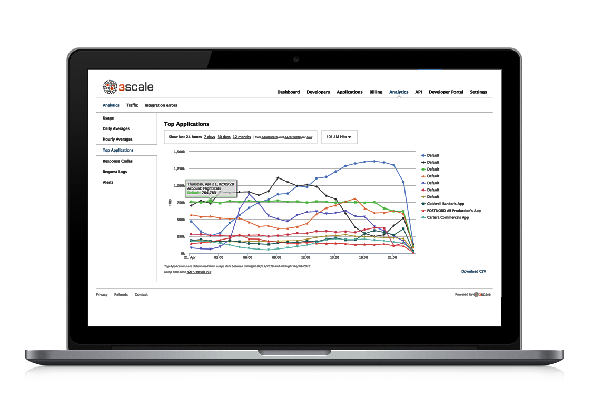

This analytics data can also be exported, and automatic alerts can be created. Customers with an Enterprise license can access the analytics also with an API provided by 3scale and, eg, integrate this data into other dashboards.

=== Feature 4: Developer and Partner portals

One of best ways to increase the adoption of an API is to provide an outstanding developer experience (DX).

A key elements of a good DX is to make it dead-simple to understand and use an API.

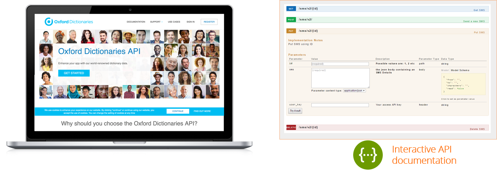

3scale customers achieve that via a fully customizable developer portal that supports all the required processes including sign-up and onboarding, account and app management, developer analytics, API key management, and API documentation.

Specifically, 3scale allows developers to examine a live API via the interactive API documentation which is based on OAI (aka Swagger).

=== Feature 5: Monetization of API

The fifth key feature of 3scale is billing and payments management.

Many of our customers choose to monetize access to their APIs, and 3scale makes that very simple. We offer key payment solution integrations among others with Stripe, Braintree/Paypal, or Adyen which all allow easy end to end billing between the API consumer and API provider.

== Admin Portal Overview

.Resources

* link:https://www.redhat.com/en/technologies/jboss-middleware/3scale[Product page]

:numbered:

== Overview

The Red Hat 3scale API Management product is available as both a Software-as-a-Service (SaaS) or on-premise.

This blog introduces you to the basic structure and look and feel of Red Hat 3scale API Management--in particular, the Admin Portal.

In more advanced courses of the _API Management_ learning path, you will have an opportunity to install and utilize the on-premise offering.

== Create a 3scale by Red Hat Domain

. In a browser, navigate to link:https://www.3scale.net[https://www.3scale.net] and click *Start free trial*:
* Alternatively, you can go directly to link:https://www.3scale.net/signup[https://www.3scale.net/signup].
+
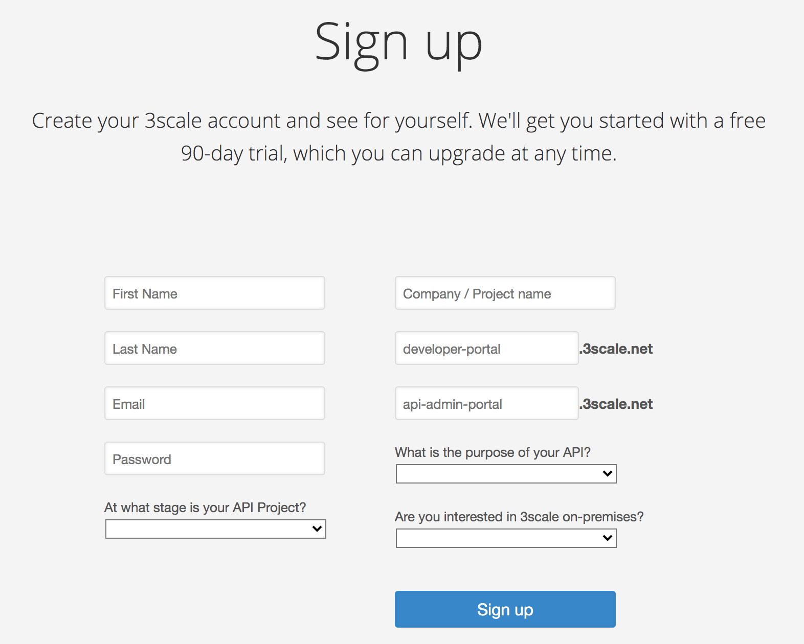

. Enter your information and click *Sign up*.
* You will receive an email that includes an activation link.

. Click the link in the email to activate your 3scale account and open the Admin Portal's login page:
+
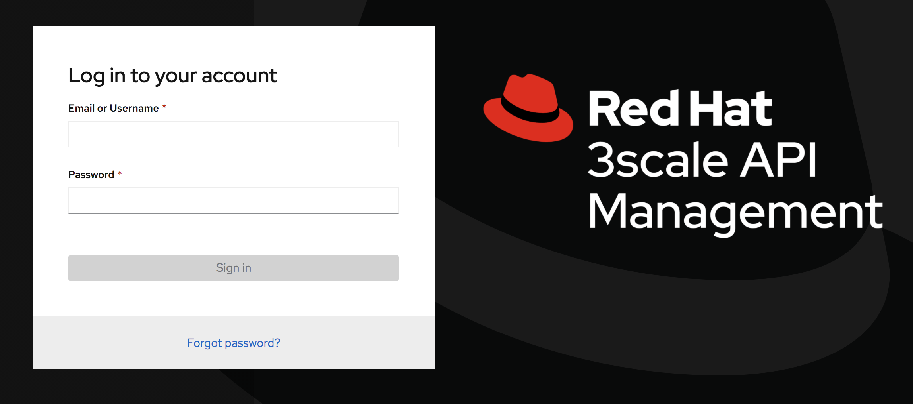
+
NOTE: the URL of the Admin Portal specific to your domain is: `https://yourdomain-admin.3scale.net`

. Enter your email address and password and click *Sign in*.
. Upon successful authentication to your new API Mgmt tenant, you will be invited to view a tutorial
. You can either choose to run through the tutorial or `X` out of this option.

At this point, a new API _domain_ has been created and you are authenticated to that _domain_ as an administrator.

== Admin Portal Perspectives

After you log into your _domain_, the Admin Portal opens to the _Dashboard_ perspective (labeled "1"):

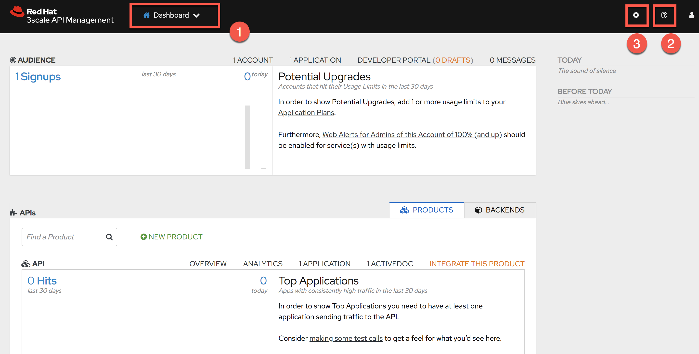

Explore the following items on the top panel:

.. Notice that the drop-down currently focused on the _Dashboard_ perspective (labeled "1") also allows for selection of:
... *Audience*
+
This perspective allows for management of accounts and developer users that will access your APIs.

... *API*
+
This perspective allows for management of your APIs.

.. Click the question mark icon at the top right (labeled "2").  This provides access to :
*** *Customer Portal* where you can learn all about the Red Hat 3scale product
*** *3scale platform API docs* where you can learn the details of the admin APIs exposed by the 3scale platform
*** *Liquid Tag reference* to assist you in the customization of your API _Developer Portal_
*** *link to product release notes*.

.. Click the *Gear* icon (labeled "3") and view your Account and Personal settings.

== Dashboard perspective

The Dashboard displays some of the key metrics about your APIs.

. If not already there, return back to the *Dashboard* perspective:
+
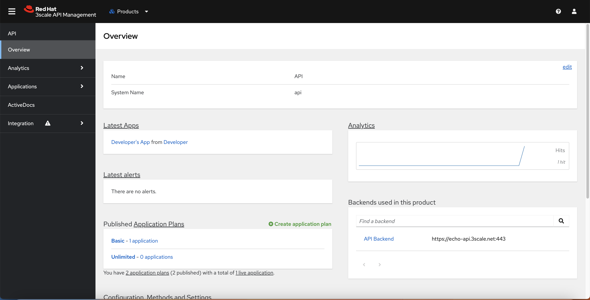

. Note the following:

* The *Audience* section (labeled "1") shows the current number of signups to an API.
** The *Potential Upgrades* section displays API consumers that are over the quota related to a certain tier.
+
NOTE: Tiers or API consumer segments are created via application plans in 3scale by Red Hat.

* The *API* section (labeled "2") lists statistics about hits against the API over the last 30 days.
** The *Top Applications* section shows the top performing applications--applications that cause a particularly high number of API hits.
This is useful information because it either means that responsible API consumers (developers) are very active or it can signify misuse.
You have the option to react by getting in touch with the developer directly, issuing warnings, or blocking API access entirely.

== Audience Perspective

The goal of exposing your APIs is to have them consumed by your customers .

The functionality found in the _Audience_ perspective allows for management of users (aka: API consumers) and groups that make up the audience of your APIs.

. Select the *Audience* perspective from the top panel:
+
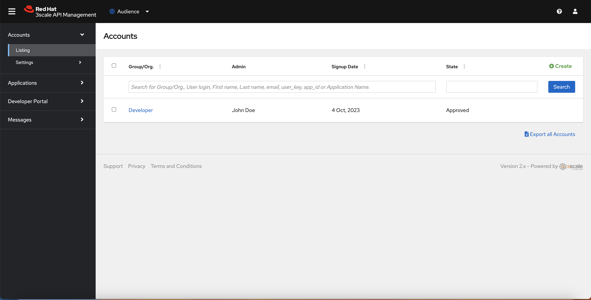

. Note that a listing of _accounts_ is rendered
+
By default, there is a default account called: `Developer` with a single user whose name is: John Doe.

. In addition, notice the following options in the left-panel of the `Audience` perspective:
* *Applications*: An industry term used to identify credentials (discussed in more detail later in this blog)
* *Developer Portal*: Content Management System (CMS) to develop the web interface that API consumers interact with your APIs (discussed in more detail later in this blog).
* *Messages*: Provides a way to get in touch with developers individually and collectively.
* *Forum*: Displays a simple thread-based forum where your API community exchanges ideas and provides help.

. Click the `Developer` group:
+
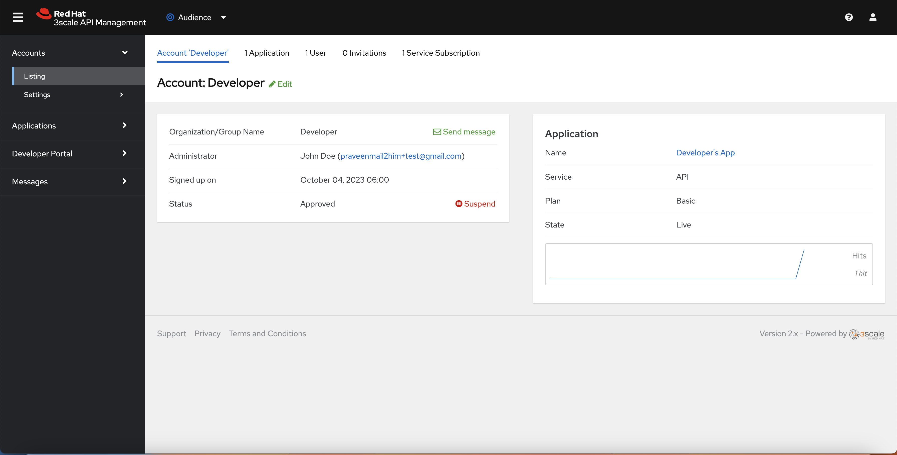

* This displays information about the subscribed organization, its users, and the various applications that are registered under it.
* In this example, an application called "Developer's app" is already registered by default. It uses the "API" service and is part of the "Basic" plan.

== API Perspective

=== Overview
The API perspective is a critical user interface of the 3scale Admin Portal.

This is where you integrate your backend service API with the API management solution.

In 3scale by Red Hat, an API Service is defined as a collection of endpoints that logically belong together and as such should be managed together (share the same policies).

With the creation of a new domain, an API is automatically configured for the purpose of demonstration and test.
This test API manages a simple RESTful service exposed at:  https://echo-api.3scale.net:443

. Select the *API* perspective from the top panel
+
Notice that an _Overview_ page is provided pertaining to your initial default api called:   _api_.
+
TIP: In the 3scale SaaS environment, you are currently limited to a single API.
_Enterprise_ customers of the Red Hat 3scale SaaS environment can create more than one API Service.
To learn more, contact the 3scale by Red Hat sales team to request an _Enterprise Trial license_.

. Note the additional options on the left panel:
* *Analytics* : This is where you'll find graphs that depict the utilization of your APIs that you've made available to your API consumers.
* *ActiveDocs*: This is where you specify your interactive API documentation, which you cover in a later module about setting up the Developer Portal.
* *Integration*: This is where you configure the details of the API that is to manage your backend API service.
+
Notice that the _integration_ option allows for a drop down selection of additional options:

** *Configuration*: allows for configuring the API gateway and security types that will be used to manage your backend API.
** *Methods and Metrics*: allows you to define several methods and metrics related to this API Service, which you learn about in greater detail in a later module
** *Settings* allows you to configure some basics related to the API Service such as developer signup processes.=== Explore Application Plans

=== Application Plans and Applications

Application Plans establish the rules (aka: policies: onboarding procedures, limits, pricing / moneitization models, features) for using your API.
There can be many application plans defined for a particular API.

Application Plans are created by the API provider via the Admin Portal and are viewable to API consumers via the _Developer Portal_ (introduced later in this blog).

An _application_ is an industry term used to identify credentials.
In 3scale, it is the association between an API consumer's account and an Application Plan.
An _application_ is required to invoke a backend service managed by a 3scale API.
Every API consumer's _application_ accessing your API will be accessing it within the constraints of an _Application Plan_.

You (as the API provider) can add, delete, or change application plans and applications at any time.

. From the `API - Overview` page, scroll down to the button to the section entitled:  _Published Application plans_

. Note two test application plans with the following names already created:  _Basic_ and _Unlimited_.
+
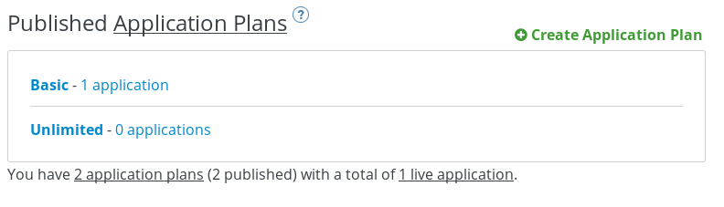
+
As the API provider, you can tailor the names of your application plans to describe their business functions.

. Note an application associated with the Basic application plan
+
Using the API key associated with this live application, an API consumer could be authorized to invoke your backend service.

. Note the _Unlimited_ currently has no _application_ associated with it.
+
At this time, no API consumer could be authorized to invoke your backend service as per the rules defined in the _Unlimited_ Application Plan.

. Select the application associated with your _Basic_ Application Plan.
+
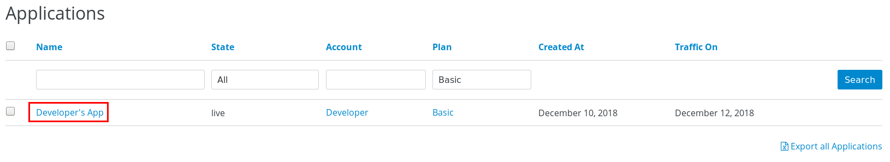

. Click `Developer's App`:
+
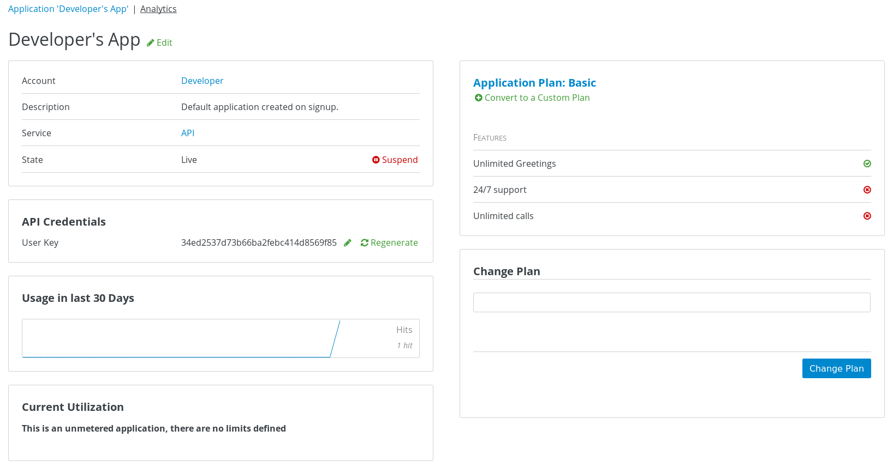
+
This provides detailed application information, including the description, state, usage, related application plan--and most importantly, the API credentials and the ability to regenerate them.

=== API

. View the details of default configuration of your _API_ service by navigating to: *API -> Settings*
+
Notice that your API service is automatically set for the following:

.. It is managed by a test API Gateway that comes included as part of the 3scale SaaS environment and is managed by the 3scale operations team.
+
The alternative would be to manage your backend service API by deploying your own API gateway.
The gateway can be deployed on the customer's premise or in a private or public cloud. 
With this approach, there are many possible configurations options you can possibly make to your own API Gateway. 
This is the option Red Hat recommends for production scenarious.
You utilize this option in more advanced courses of the API Management learning path.
+
Another alternative would be the _Plugin_ approach.
3scale by Red Hat offers a range of plug-ins that can directly form part of your code base and are included as libraries. 
The supported languages include Ruby, Java, Python, Node.js, Perl, PHP, and .NET.

.. Its security mechanism is: _API Key_
... This is the security mechanism most commonly used for testing purposes.
... This option requires distributing a key to API consumers so that they can append this key as a query parameter to each inbound request to the API gateway.
... Other alternatives offered for increased security and scalability are:  ID/key pair and OAuth

. View the APIcast configuration of your _API_ service by navigating to: *API -> Configuration*
. In the _APICast Configuration_ section, click the button allowing for promotion to Staging
+
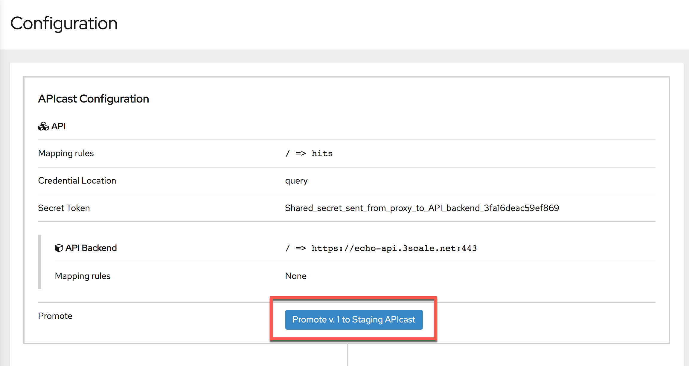

. Repeat the process to promote to Production.

Your API is now accessible via the production API gateway.

=== Explore Analytics Tab

. Navigate to: API -> Analytics
+
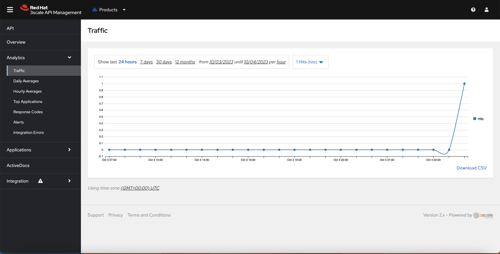

. The default view is the Traffic chart.
. In the navigation pane on the left, you have access to additional analytics:
** Daily Averages
** Hourly Averages
** Top Applications
** Response Codes
** Request Logs
** Alerts

* The Analytics tab also allows you to export the data as a CSV file and interact with it via the 3scale platform API.

NOTE: In a later module, you learn more about API analytics using real statistics, including how to interact with them.

== Explore CMS and Developer Portal

The _Developer Portal_ is the user interface that users of your APIs will utilize.
The Developer Portal is customizable by you, the API provider.
A good developer portal is a must have to assure adoption of your API.
The Red Hat 3scale product provides API providers with a  _content management system_ (CMS) to configure everything that is necessary to expose the API and its documentation to the API consumers.
This CMS that is based on web technologies such as HTML, CSS, JavaScript and link:https://shopify.github.io/liquid/[Liquid].

=== What is Liquid?

link:https://shopify.github.io/liquid/[Liquid] is an open-source template language created by Shopify and written in Ruby.

It is the backbone of Shopify themes and is used to load dynamic content on Shopify based storefronts.

The project is link:https://github.com/Shopify/liquid[open-source].

3scale liquid templates are based on Shopify templates.
When making customizations to your Developer Portal, you'll work extensively with Liquid .

=== CMS
Your API _domain_ comes out of the box with the web files needed to expose the default _Echo API_ in the _Developer Portal_.

In this section, you'll view the source code of this web content via the CMS.

. If you are not already there, navigate to the _Audience_ perspective.
. Navigate to: *Developer Portal -> Content* in the left panel

. On the left-hand side you see a navigation bar for all the assets that make up your Developer Portal.
. Click any of the files to view the source code.
+
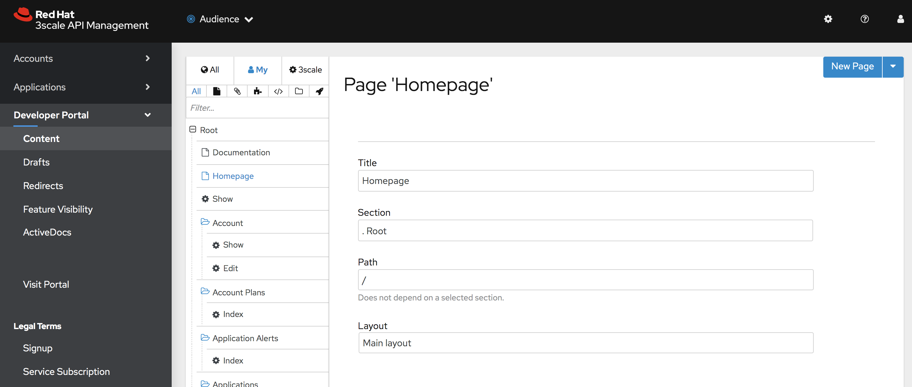
.. All options can be fully customized.
.. The entire look and feel (colors, fonts, images, etc.) can be modified.

In more advanced courses in the API Management learning path, you will learn how to customize the Developer Portal via this source code found here in the CMS.

=== Developer Portal

Now that you have been exposed to a bit of the source code that powers the look and feel of your Developer Portal via the CMS, let's switch to the Developer Portal to view what your developer customers see.

. Click *Developer Portal -> Visit Portal* to open the developer-facing view of the portal in a new window:
+
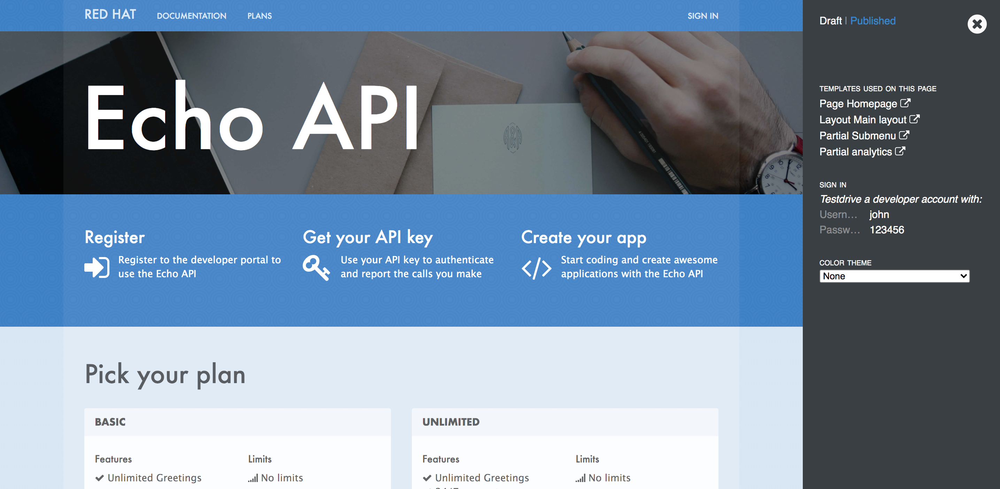 
. This shows the default look and feel of the Developer Portal.
. The _audience_ of your APIs will authenticate into the Developer Portal (they do not have access to the Admin Portal like you do).
.. 3scale is highly customizable in regards to developer _sign-up flows_.
.. You as the API provider have the ability (via the CMS) to fine tune every aspect of the flow for a developer to sign-up for one or more of your APIs.

. You learn more about how a developer portal can be created, customized, and published in a later module.

== How to Manage an API?

In this section, you learn how to integrate Red Hat 3scale API Management with an existing API. 
You start with an existing and freely available API and then add the 3scale by Red Hat API management integration to it. 
You also have the opportunity to use one of your existing web APIs.

.Goals

* Understand how to add basic security and control to an existing API using 3scale by Red Hat
* Test a configuration in a staging environment
* Deploy a configuration into production

:numbered:

== Review Demo API

For this section, you use the freely available Finto API. 
Finto is a Finnish thesaurus and ontology service that enables both the publication and browsing of vocabularies.

. In a browser, navigate to the link:http://finto.fi/en/[Finto service website].
.. Explore as much as you like to see how the service works.
. In another browser window, navigate to link:http://api.finto.fi[http://api.finto.fi].
* This is the base URL to the version of the API you use for this blog.
* The service offers a REST API for integrating the thesauri and ontologies into other applications and systems.
* The API is currently unprotected, which enables you to integrate, secure, and manage it via 3scale by Red Hat.
* The Finto API offers over 20 different endpoints such as the `GET/rest/v1/vocabularies` endpoint located at link:http://api.finto.fi/doc/#!/Global_methods/get_vocabularies[http://api.finto.fi/doc/#!/Global_methods/get_vocabularies].
* You can access the OAS/OAI (aka Swagger) based API documentation at link:http://api.finto.fi/doc/[http://api.finto.fi/doc/].

== Configure API Management Integration

Recall from the previous section that you currently have one API Service called `API` (set up automatically when you created your account).
You use this API Service to configure your managed Finto API.

=== Define API Management Methods and Metrics

In this exercise, you define methods and metrics related to the Finto API Service.

. Authenticate into the Admin Portal (if not currently logged in).

. Navigate to `API Backend -> Methods & Metrics`:

* On this screen you can define methods and metrics, which enable you to configure your API management policies in a very fine-grained way.
* Methods are used to map certain web resources (URIs) to configurable method names.
* Metrics define what you actually want to measure relative to your methods, which represent endpoints.
* The built-in top-level metric is Hits, which is a simple counter that provides statistics about how often an endpoint is called.
* You can also define other types of metrics such as megabytes, CPU time, number of elements returned by the API, etc.
+
NOTE: For more information about the concepts of methods and metrics in 3scale by Red Hat, refer to the link:https://access.redhat.com/products/red-hat-3scale[Support Portal].

You use the Hits metric for this section and then define a new method.

. At the far right, click *New method*:

. Define a method that you can map later to the `GET /vocabularies` endpoint with values as follows:
.. *Friendly name:*     GET /vocabularies
.. *System name:*       get_vocabularies
.. *Description:*   Finto API GET endpoint that returns list of available resources

. Click *Create Method*.
+
The new method appears in your list of methods.
+
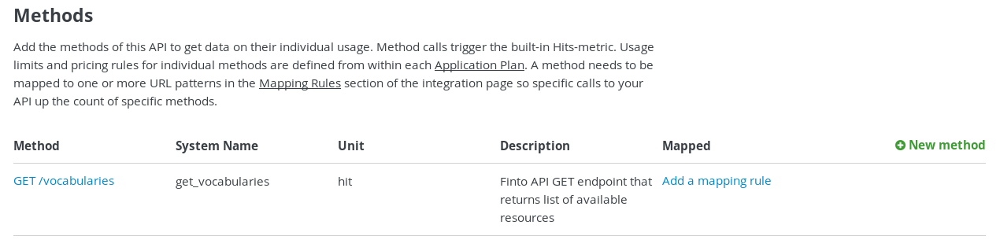

=== Configure API Backend

. Navigate to: `API Backend`
. Click `edit`.
+
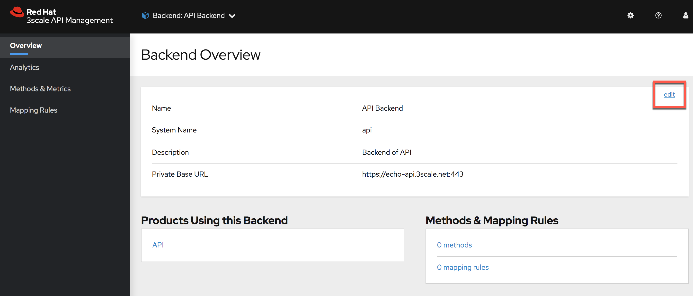

. In the *Private Base URL* field, enter `http://api.finto.fi:80`.

. Click *Update Backend*

* Note that this includes the HTTP protocol and the port at the end. Typically you use HTTPS and port 443, but in this case you need to use what Finto provides.
* When this is done, the private base URL is mapped onto a public base URL, which is the one that is then shared with your API consumers (usually through the 3scale Developer Portal).

. In the left hand panel, click *Mapping Rules*:
* You see the `hits` mapping rule which has been predefined to count all hits against the API.

. In the left hand panel, click *Mapping Rules*.
. Click the link for *Add Mapping Rule*.
* A new line appears.

. Select *GET* as the *Verb*.
. In the *Pattern* field, enter `/rest/v1/vocabularies` as the endpoint.

. Select `get_vocabularies` as the *Metric or Method*.
** This is the method you defined earlier.
**This mapping rule allows you to specifically count all hits that your API receives against the specific /vocabularies endpoint. You learn more about this in the API Analytics topic in a later module.

. Click *Create Mapping Rule*

=== Promote to Staging and Production

Finally, the last thing you need to do is deploy your configuration to the staging and production environment.

. Click *API -> Configuration* 
. Click the button allowing for promotion to Staging. Repeat the process for Production

* This deploys the exact same configuration into the production API Gateway hosted by 3scale by Red Hat.
* This is suitable for testing and for low-volume API programs.

== Test API Management Integration

. To test access to the Finto API via the production gateway you'll need the following information:

.. *Production URL*
+
The production URL can be determined by navigating to: *API -> Configuration*. Scroll down to *Production APIcast* section
+
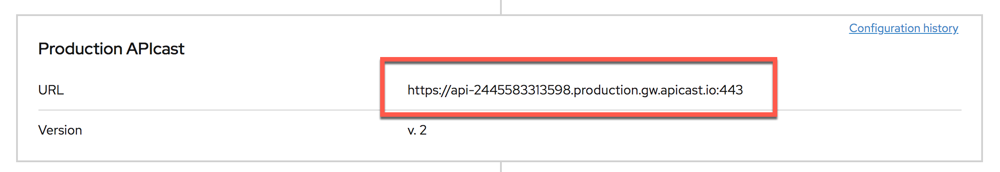

.. *Web Context Path*
+
The value is: /rest/v1/vocabularies?lang=en

.. *API Key*
+
The value of the API Key can be determined by navigating to `API -> Applications -> Listing -> Developer's App -> API Credentials`
+
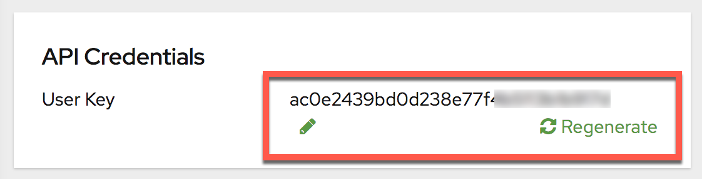

. Open a new tab in your browser and enter in a URL that is a concatenation of the three string values
+
An example full URL would be as follows:
+
-----
https://api-2445582656180.production.gw.apicast.io:443/rest/v1/vocabularies?lang=en&user_key=34ed2537d73b66ba2febc414d8569f85
-----

. The response back should be as follows:
+
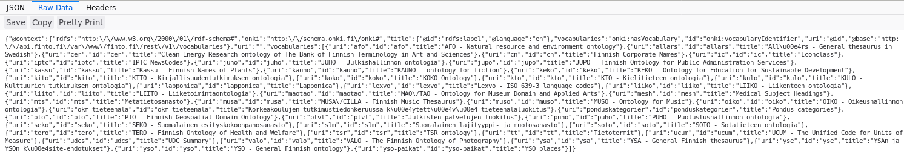

. Navigate to *API -> Analytics -> Traffic*

* This section shows the total API hits and the ones counted specifically for the `/vocabularies` endpoint that you configured.
* Each time you send a call to a Finto endpoint, the count increases.

== Useful Resources

For further information please refer to the following resources:

* The Red Hat 3scale API Management Platform https://www.redhat.com/en/technologies/jboss-middleware/3scale[product page].
* The 3scale https://www.3scale.net/[website] (specifically the https://www.3scale.net/resources/[Resources] section).
* The 3scale https://access.redhat.com/products/red-hat-3scale/[Support pages].
* 3scale's http://pages.3scale.net/winning-in-the-api-economy-lp-wb.html[Winning in the API Economy] ebook.

ifdef::showScript[]

endif::showScript[]